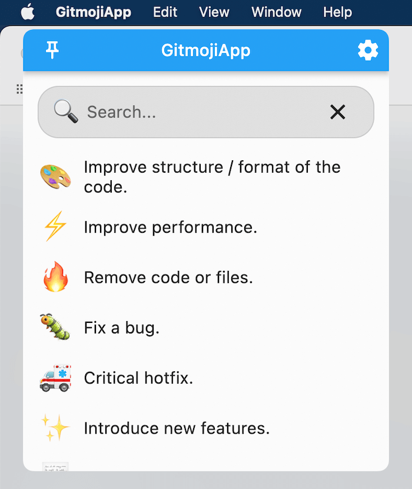
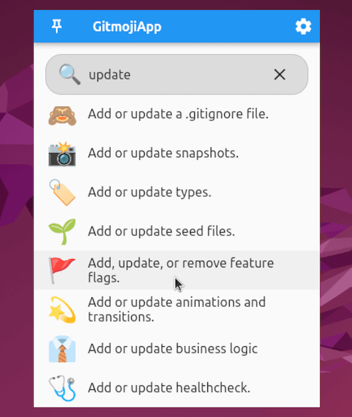
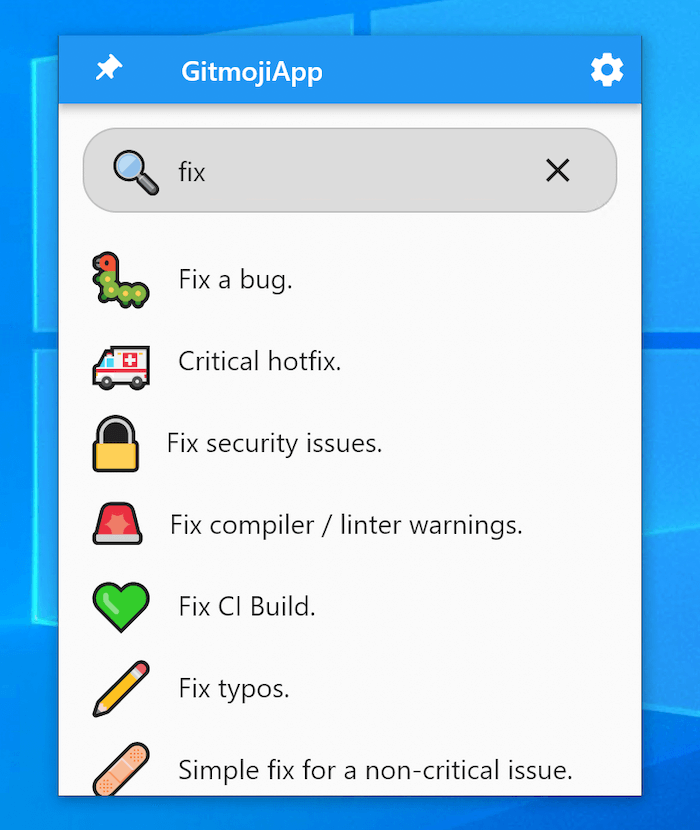

# GitmojiApp

A Gitmoji app for macOS, Linux, and Windows.

macOS | Linux | Windows
:----:|:-------:|:-----:
||

## What is this

GitmojiApp is a simple desktop app that allows you to add a [Gitmoji](https://gitmoji.dev) to your git commit messages.

## Installation

### Download

Download the latest prebuilt binary from [Github release](https://github.com/patrick-fu/GitmojiApp/releases)

> Note that the  macOS App is not notarized by Apple, so you should right click the "GitmojiApp.app" and select "Open" for the first time, then move it to your `/Applications` folder.

Or you can codesign it by yourself to make it a trusted app.

```bash
# Unzip the artifact and cd into the folder
$ codesign -dfs - ./GitmojiApp.app
```

### Compile by yourself

```bash
# flutter v3.0.0 is required
$ flutter pub get

# On macOS
$ flutter build macos

# On Linux
$ flutter build linux

# On Windows
$ flutter build windows
```

## Todo

- [ ] Dark mode
- [ ] Color theme
- [ ] Localization
- [x] Tray mode
- [x] Font embedded
